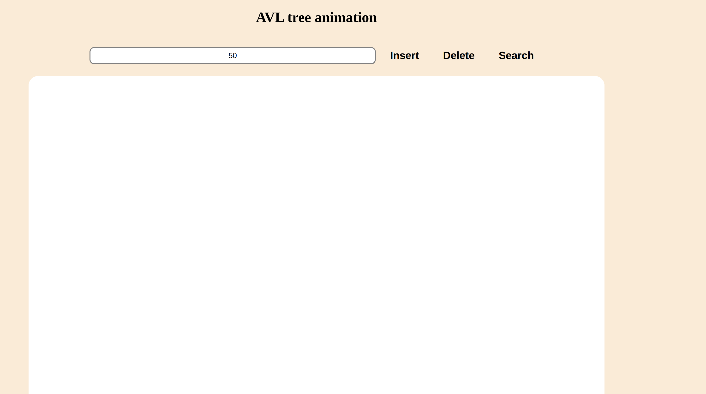
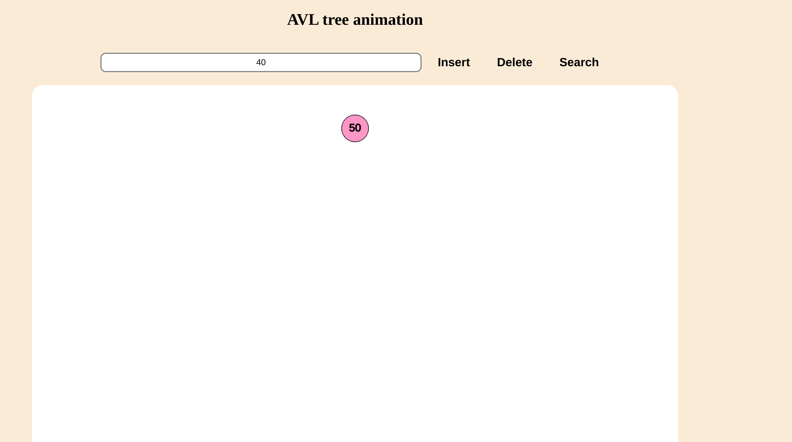
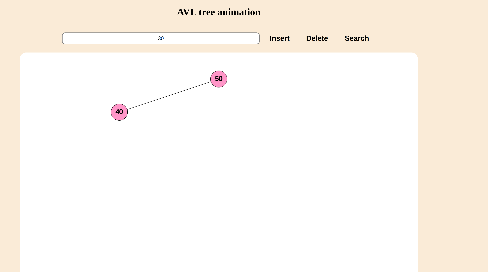
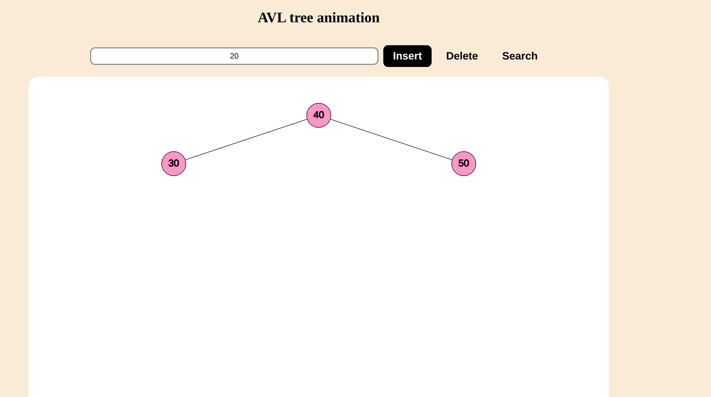
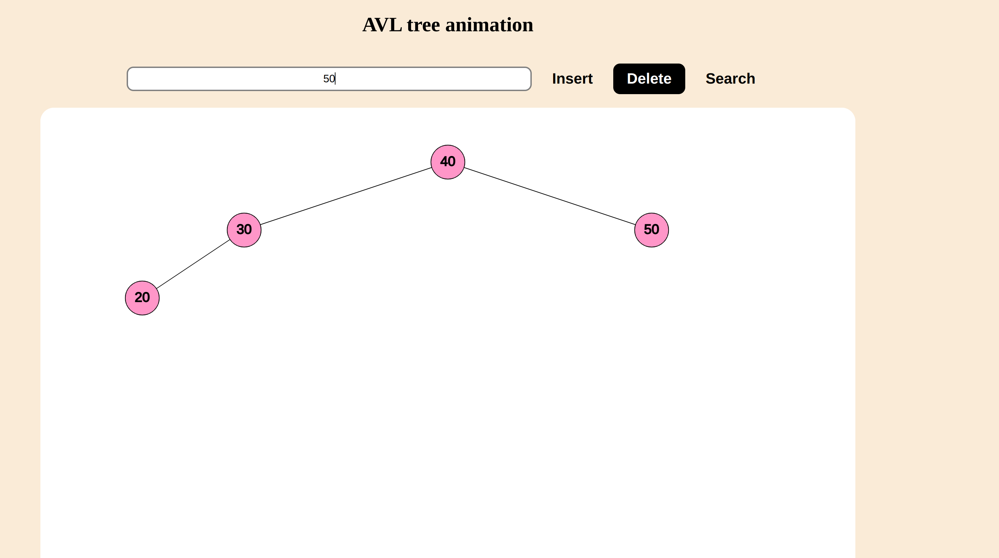
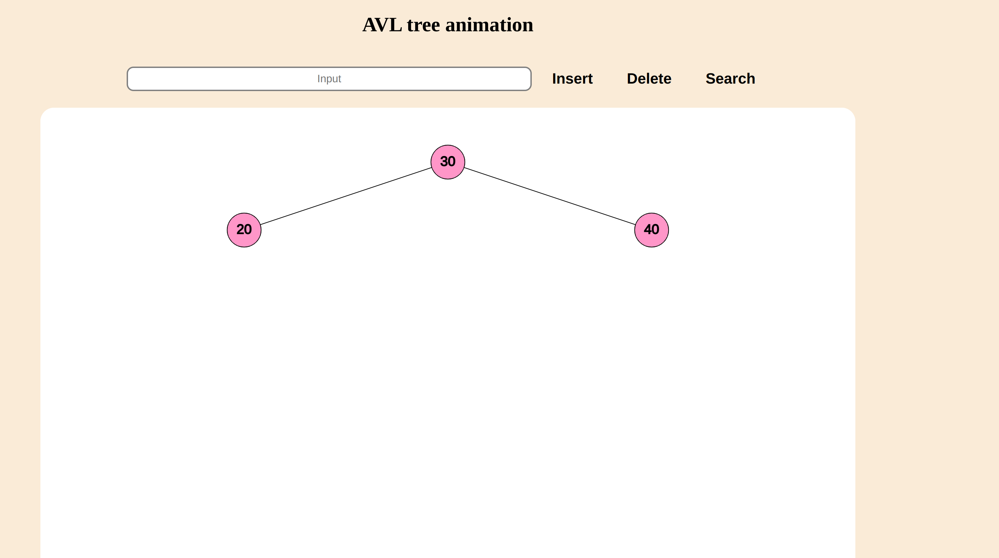

# DSA2025 soft engineering : AVL tree visiualize
## overview
this project illustrate how an **AVL tree** work to ensure the nature of binary search tree while balance the height of the tree to guarantee that all the search ,  delete , insert operation can be done in $O(log n)$.
## feature
- ✅support all the operation in the original binary search tree, including search , deletion , insertion
- ✅the height of tree can balance itself so that all the operation can be done in $O(log n)$
## usage
there is a input box on the top center of the screen , you can type any real number and doing operation by press the Insert, Delete, Search button besides it.
> ⚠️ **Note:**  
> It is recommended to insert numbers with fewer than 4 digits,  
> or the text may overflow the node circle.
### insertion
type a number and press the insert button and it will search the position where the node should be and insert it and than rotate it to keep the tree balance
### deletion
type a number and press the delete button so that it will search the node and if it exist it will find the successor of the node and delete the node by replacing it to its successor and than rotate it to keep it balance
### search
type a number and press the search button and it will search it by illustrate its current position and display whether the node exist
## example
there are no node in initial state

insert 50 40 30 20 in order and we can see that it will balance itself

delete 50 and it will also balance itself

## Contribution
